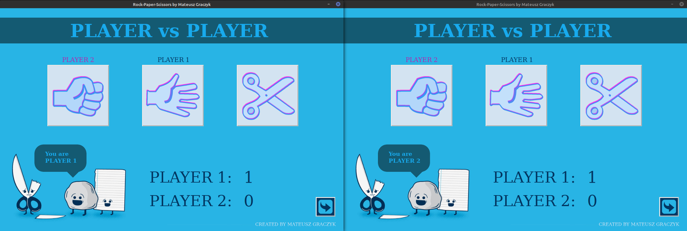

# Rock-Paper-Scissors
Hello everyone!
Today I want to show you my next project called Rock-Paper-Scissors. It's a simple game that everyone knows. We have a single and multiplayer (bot / LAN) version. I have worked for couple of months with a lot of breaks (because I study at university) and the main reason for doing this project was wo create something with networking. At that time I realized that I had to use multithreading and socket (TCP) communication. 

Here we have how my Rock-Paper-Scissors looks like.
Enjoy.

*MENU*

*SINGLEPLAYER*

*MULTIPLAYER(LAN)*

